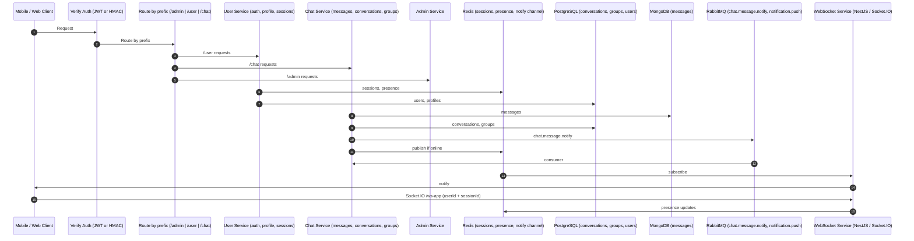
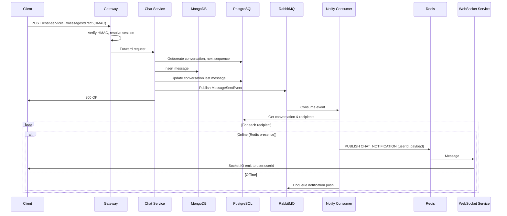
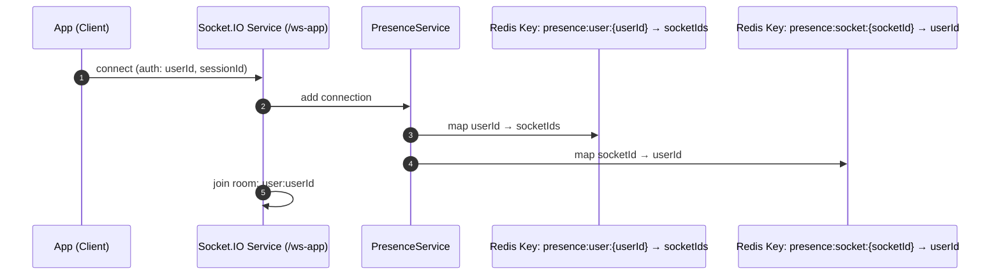

# Current Architecture Flow

Diagrams for the **current** chat application (before OpenIM). See [sections/01-current-architecture.md](../sections/01-current-architecture.md) for the full description.

---

## 1. Component & Request Flow

---

## 2. Message Send & Realtime Delivery (Sequence)

---

## 3. Presence & WebSocket

---

*Back to [README](../README.md) | [Section index](../sections/00-INDEX.md)*
