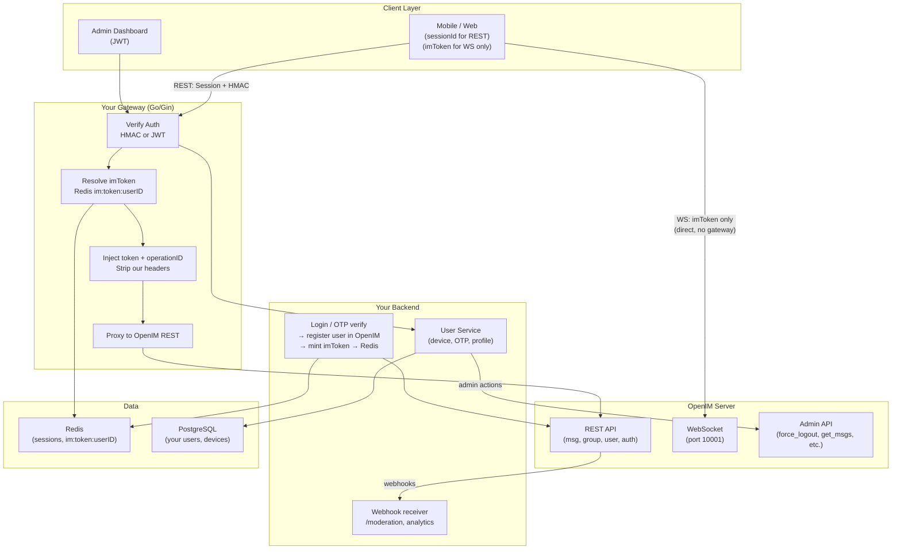
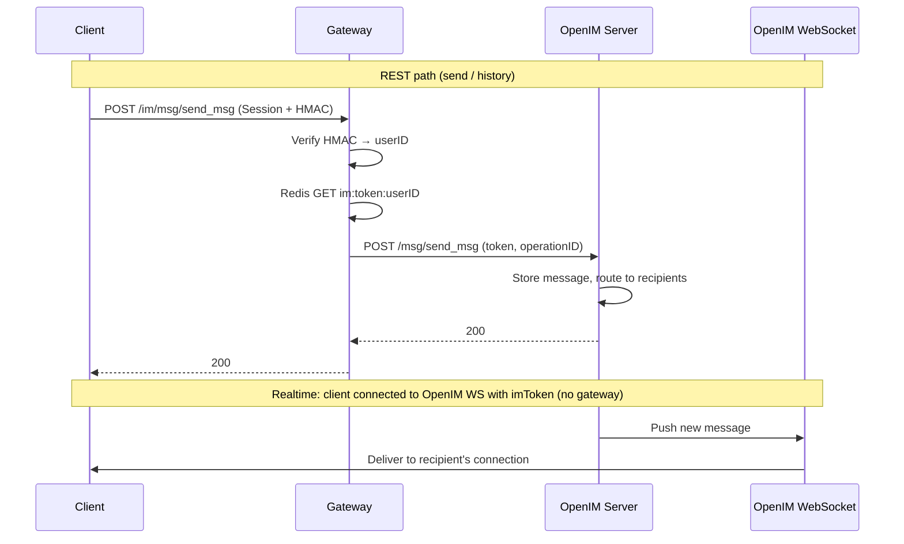
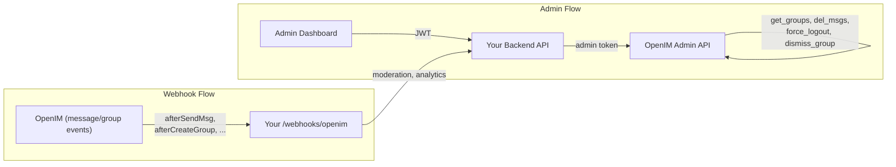

# OpenIM Integration Flow

Diagrams for the **target** architecture with OpenIM. See [implementation-doc.md](../implementation-doc.md) and the [sections/](../sections/) for full description.

---

## 1. Component & Two Paths (REST vs WebSocket)



---

## 2. Login & imToken Lifecycle

```mermaid
sequenceDiagram
    participant C as Client
    participant G as Gateway
    participant Backend as Your Backend
    participant OpenIM as OpenIM API
    participant Redis as Redis

    C->>G: POST /api/v1/auth/otp/verify (HMAC + OTP)
    G->>Backend: Forward
    Backend->>Backend: Verify OTP, create/find user, create session
    Backend->>OpenIM: Register user (if new)
    Backend->>OpenIM: Mint user token (userID, platformID)
    OpenIM-->>Backend: imToken
    Backend->>Redis: SET im:token:userID, imToken (TTL 7d)
    Backend->>C: 200 { sessionId, imToken, wsURL, user, ... }

    Note over C,Redis: Client stores imToken for WebSocket only. REST uses sessionId; gateway injects imToken from Redis.
```

---

## 3. Message Send & Realtime (OpenIM)



---

## 4. Admin & Webhooks



---

*Back to [README](../README.md) | [Section index](../sections/00-INDEX.md)*
